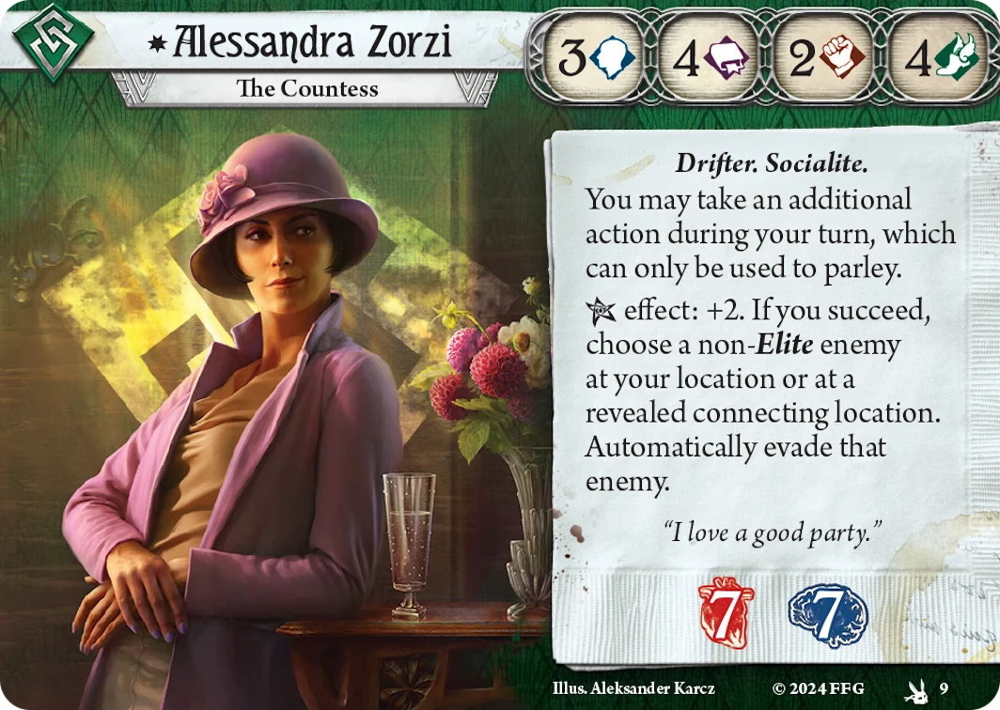

# [Alessandra Zorzi](https://arkhamdb.com/card/10009)

<figure markdown='span'>

</figure>

* Lean heavily into her unique "Parley" synergy, specifically aiming to reduce test difficulties to zero. Need a lot of card in hands.

[Deck for the campaign](https://arkhamdb.com/deck/view/4479599) as a clue seeker but also being able to evade enemies. [Quick Learner tutorial deck](https://arkhamdb.com/decklist/view/47003/alessandra-s-parley-party-fhv-intro-deck-guide-1.0)

## Deck building

focus on parley cards, [Fine Clothes](https://arkhamdb.com/card/02272), [Well dressed](https://arkhamdb.com/card/10130), [Eldrich Tongue](https://arkhamdb.com/card/10128), [vamp](https://arkhamdb.com/card/10074)  [Motivational Speech](https://arkhamdb.com/card/09028) and [String of Curses](https://arkhamdb.com/card/09088) and card draws: Lucky Cigarette Case. [Bianca "Die Katz"](https://arkhamdb.com/card/10062) to get cash or [Grift](https://arkhamdb.com/card/10071), [Bank job](https://arkhamdb.com/card/10069), [Lone Wolf](https://arkhamdb.com/card/02188), [Scrimshaw charm](https://arkhamdb.com/card/10068). [British bull dog](https://arkhamdb.com/card/10065) (0 and 2), [Fake credentials](https://arkhamdb.com/card/10066), 

Boost stats: Streetwise,  [Fox Mask](https://arkhamdb.com/card/10067), [Backtab](https://arkhamdb.com/card/01051)
Attack with other stats: [Stir the Pot](https://arkhamdb.com/card/10083), [Blackmail file](), [coup de grace](https://arkhamdb.com/card/04269)
Action optimization: [Leo de Luca](https://arkhamdb.com/card/01048), [Narrow Escape](https://arkhamdb.com/card/03267),  [Scout ahead](https://arkhamdb.com/card/08047), [Slip Away](https://arkhamdb.com/card/04232), [Quick thinking](https://arkhamdb.com/card/02229), [Nimble](https://arkhamdb.com/card/60317)

Upgrade: British Bull Dog, Fake Credentials, [Lola Santiago](https://arkhamdb.com/card/04196), [Snitch](https://arkhamdb.com/card/10078), [Bewitching](https://arkhamdb.com/card/10079)

## Strategy

* Leverage parley card to get one free action, but require a nearby enemy. She also needs a lot of cards. 
* Gameplay is to Parley enemies at a location with clues or one with clues nearby, using Snitch or Fake Credentials to pick up clues.
* Resources should help to play events and boost stats
* Mulligan to get her Beguile, fine clothes
* Leverage agility stat to fight enemies: British Bull Dog, and Stir the Pot

* [A FOHV runs when he finished killed- My arkhamdb deck](https://arkhamdb.com/deck/view/4254493)

* [Justin's video](https://www.youtube.com/watch?v=ik9K0qyc1ts&t=1143s)
* [Rather incoherent video](https://www.youtube.com/watch?v=2fTrWChtFHA)