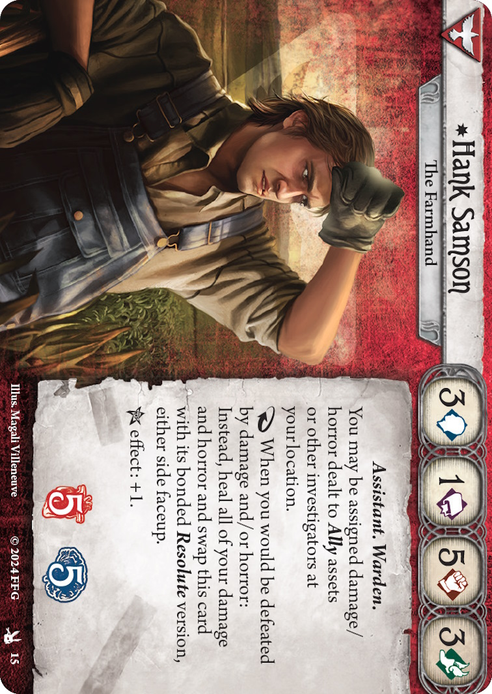

# [Hank Samson](https://arkhamdb.com/card/10015)

<figure markdown='span'>

</figure>

[First deck was not strong enough](https://arkhamdb.com/deck/view/4254493). [Second run Hank deck](https://arkhamdb.com/deck/view/4910692) after upgrade of keep faith, fire axe (2), token of faith, survival technique and marine compass. Then ancient covenant.

He can tank damage/horror for other investigators and effectively has 10 health and sanity combined. He can take damage/horror for other investigators during the assign step (not his allies). Works well with cards that let him profit from, transfer, or heal damage.

## Strategy

get damages earlier and change to a resolute format: tanker or flex. Mulligan to get Southearted, and  weapons. Moving damage is not healing. 

* Can give the pitchwork to an other investigator
* With Pitchwork kill an enemy, move and come back to the location to get the weapon
* He can intentionally sequence enemy attacks (smaller ones first) to maximize his healing ability.
* "The Farmhand" - Focus on tanking damage and protecting teammates.
* "The Warden" - Combat-focused build using his high combat stat
* "The Assistant" - More balanced approach with support capabilities
* Protect him during attack and pay attention against horror

## Deck building 

* Assess if you want to play with the bag, if so, select Accursed from mystic.
* Design the deck for the resolute side too, and for action compression
* Can be oriented with Dark Horse, Lablanche
* Can be effective with allies like [Jessica Hyde] and [Peter Sylvestre]
* Using FOVH cards: **2x Sparrow mask, 2x Pitchwork, 2x Bide your time,** (next turn at 5 actions to plan for the worse turn - or when the agenda will change to be ready)  matchbox, leather coat, pushed to the limit, wrong place right time, look at I found, or 2x `baseball bat` or `Fire Axe`. 2x Elaborate distraction, 2x pushed the limit, 2x wrong place, right time. 2x [long shot](https://arkhamdb.com/card/10116) (can be used for skill at connecting location, and not just attack. Good synergy with [Hatchet](https://arkhamdb.com/card/10117)).
* Leverage look what I found to get clues and its upgrade version (Stella Clark), may be 'Belly of the beast' 
* [Pelt shipment](https://arkhamdb.com/card/10109) to play close to the end of a scenario, get a free xp.
* From the core set consider: rabbit foot, leather goat, `lost what I found` for 2 shroud locations. Cache, Guts, Lucky, Cunning distraction 
* Other weapons to consider: [chainsaw](https://arkhamdb.com/card/60529), hatchet, 
* Cards for higher experience ones:  2x fire axe, 2x Hatchet, [Strong armed](https://arkhamdb.com/card/10031), [second wind](https://arkhamdb.com/card/04149), [persistence]. [Devil](https://arkhamdb.com/card/10119), Hunting Jacket, Mariner Compass. Dark Horse L5. From core: Bullet proof and [elder sign amulet](), Eucastastrophe, emergency cache L2, Aquinnah to soak horrors. Token of Faith, Providential. 
second wind, hunting jacket, fire axe, 
Eucatastrophe