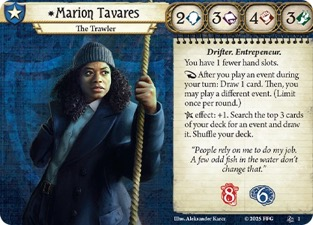

# [Marion Tavares](https://arkhamdb.com/card/11001)

<figure markdown='span'>

</figure>

Dedicated "Fighter" for the group, even though Marion naturally works well as a Flex character. A good 2,3,4,3  statline, which encourages some flexing - especially with [Determined](https://arkhamdb.com/card/11002) which provides recurable  boosts on events.

**Deck Theme:** The deck is heavily built around playing a massive number of events. So it combines well with Nathaniel Cho deck.

Due to her weakness: "I will do it myself": Discard 3 events from your hand: Discard "I'll do it myself.", think of events which can be played from your discard pile like: [Winging It](https://arkhamdb.com/card/04272), [Improvised Weapon](https://arkhamdb.com/card/11092), [A Glimmer of Hope](https://arkhamdb.com/card/06245) and [Impromptu Barrier](https://arkhamdb.com/card/04312).

* [See card study](https://arkhamdb.com/card/11001)
* [this deck: Marion a Gunbit](https://arkhamdb.com/decklist/view/53619/marion-takes-a-gunbit-1.0) 
* [One-Punch Marion](https://arkhamdb.com/decklist/view/53705/one-punch-marion-tdc-blind-run-deck-guide-1.0)
* [Field Agents on a Boat!](https://arkhamdb.com/decklist/view/54200/field-agents-on-a-boat-hc-7-5k-guide-1.0)
* [My 1st deck for Marion](https://arkhamdb.com/deck/view/6166362?deck_name=The%20Adventures%20of%20Marion%20Tavares%20Drowned%20City)

### Key Assets/Non-Events

Always consider the cards added in the investigator box for the matching campaign:

* so [Double Down](https://arkhamdb.com/card/11107), [Bound for the Horizon](https://arkhamdb.com/card/11102), [True Awakening](https://arkhamdb.com/card/11106) and **[Nose to the Grindstone](https://arkhamdb.com/card/11111)**
* [Blessed blade](https://arkhamdb.com/card/07018) as a second weapon, Bless token generator and to prepare for the upgrade
* Run "[Hand Hook](https://arkhamdb.com/card/11082)" and "Beat Cop" to boost the combat stat.
* Rely on the new [Remington](https://arkhamdb.com/card/11022) firearm, treated essentially as an event because of how well it combos with cards like "[Act of Desperation](https://arkhamdb.com/card/05037)" and [Push to the Limit](https://arkhamdb.com/card/10113). We need to make it come and go as many times as possible
* "Hallowed Mirror," which is an asset that effectively adds three powerful events to the deck.
* [Wolf Mask](https://arkhamdb.com/card/10023)

### Skills

* [Take the Initiative](https://arkhamdb.com/card/04150) is used for protection, compensating for Marion's low willpower stat of 2.
* "Vicious Blow" is used for extra damage output.

### Events Strategy

As long as you're playing an event per turn Marion gets an extra card which helps you find Hallowed Mirror. From there Soothing Melody and True Awakening offer additional cards. 

Here is a play: you’d initiate an attack of opportunity, then immediately play [Counterpunch (2)](https://arkhamdb.com/card/60122), then after resolving the event trigger and resolve Marion’s ability (**After you play an event during your turn: Draw 1 card. Then, you may play a different event**) to allow you to play a new event such as [Monster Slayer](https://arkhamdb.com/card/60116) and resolve it, and only after that would you resolve the attack of opportunity if the enemy is still in play

"fast" event cards, which can be played under any circumstances, work wonders for Marion as they allow her to combo other events in any flexible timings without spending actions.

Search string in arkhamdb: 'k:Improvised t:event p<3' 

* [prepare for the worst](https://arkhamdb.com/card/09036) to search for a weapon
* **Economy & Utility:** uses [Clean Them Out](https://arkhamdb.com/card/60111) and "Emergency Cache", [Bank Job](https://arkhamdb.com/card/10069) to fund cards.
* **Clues & Movement:** "Task Force" is highly valued because it synergizes with the Remington and allows to chain into other events, while "Look what I found!" is used to fail an investigation safely and grab clues.
* **Combat:** For dealing damage, rely on "Toe to Toe" and "One-Two Punch", [Monster Slayer](https://arkhamdb.com/card/60116).
* **Survivor Cards:** Survivor cards like "End of the Road" and "Improvised Weapon" to benefit from fast events and graveyard recursion.

### Upgrade Plans

* [Stick to the plan](https://arkhamdb.com/card/03264) to add tactic and supply cards
* plan to swap out "Vicious Blow" for [Hunter's Mark](https://arkhamdb.com/card/11026).
Quick Shot, Galvanize and Hunter's Mark.
* [Blessed Blade](https://arkhamdb.com/card/10034) as very powerful one hand weapon for Marion
* aim to upgrade to the Level 5 version of "One-Two Punch" as soon as possible.
* Other immediate upgrade targets include "Quick Shot," the upgraded "Remington," and "The True Awakening" (a Specialist card).
* Think to upgrade for card draw in card draw.
* [True Awakening](https://arkhamdb.com/card/11106) is a great catch-all event which can provide clues, healing and/or card draw